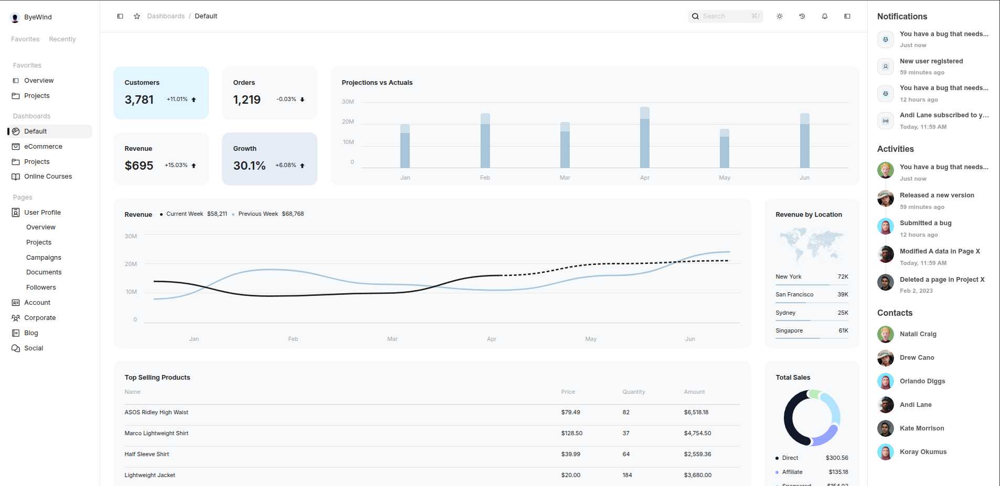
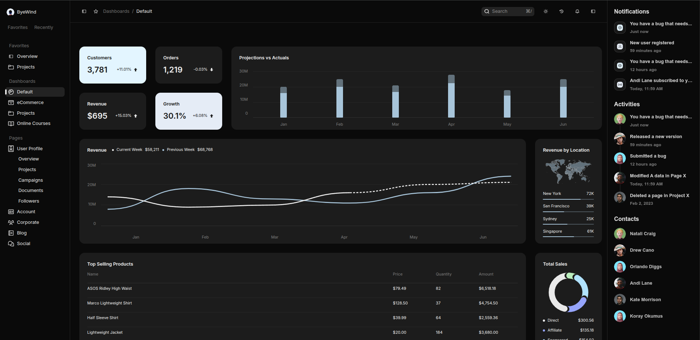
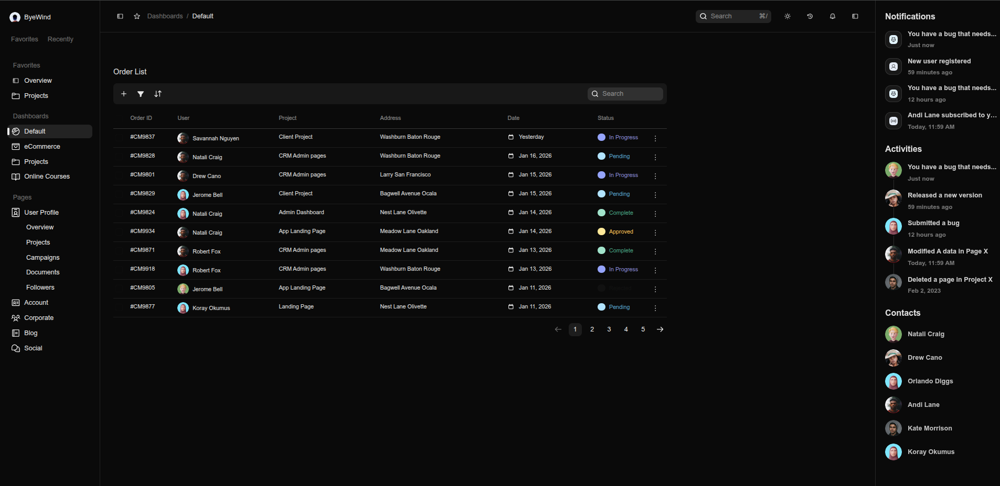

# Juspay - ByeWind Dashboard

[**View Live Demo**](https://juspay-assignment-jet.vercel.app/)

A premium, responsive eCommerce dashboard built with **Next.js 16** (App Router), **React 19**, and **Tailwind CSS v4**. This project features a comprehensive dashboard with custom data visualizations and a robust order management system.

**Video Demo**: [Watch Demo](demo.mp4)

## Tech Stack

- **Framework**: [Next.js 16](https://nextjs.org/) (App Router)
- **Language**: [TypeScript](https://www.typescriptlang.org/)
- **Styling**: [Tailwind CSS v4](https://tailwindcss.com/) & CSS Modules for scoped styling
- **Charts**: Custom SVG Implementations (Zero-dependency, Cubic Bezier Curves)
- **State Management**: React Context (Theme) & Server Actions
- **Icons**: Custom SVG System
- **Animation**: CSS Transitions

## 📦 Getting Started

### Prerequisites

- Node.js (v18 or higher)
- npm, yarn, or pnpm

### Installation

1. **Clone the repository**:

   ```bash
   git clone https://github.com/yourusername/juspay-assignment.git
   cd juspay-assignment
   ```

2. **Install dependencies**:

   ```bash
   npm install
   # or
   pnpm install
   ```

3. **Start the development server**:

   ```bash
   npm run dev
   # or
   pnpm dev
   ```

   Open [http://localhost:3000](http://localhost:3000) with your browser to see the result.

4. **Build for production**:

   ```bash
   npm run build
   # or
   pnpm build
   ```

## 📸 Screenshots

| Dashboard Light Mode | Dashboard Dark Mode |
|:---:|:---:|
|  |  |

| Orders Light Mode | Orders Dark Mode |
|:---:|:---:|
|  |  |

## Design Decisions & Architecture

### 1. Zero-Dependency Custom Charts
Instead of relying on heavy charting libraries like Recharts, I implemented the **RevenueChart** and **SnowChart** using raw SVG and math (`cubic-bezier` calculations).
- **Benefit**: Significantly reduced bundle size.
- **Control**: Pixel-perfect matching of the design mockups.
- **Performance**: Smoother rendering without overhead.

### 2. Next.js App Router & Server Actions
Leveraged the latest Next.js 16 features.
- **Folder Structure**: Used the `app/` directory for routing.
- **Data Fetching**: Mocked data patterns closer to real-world server-side fetching suitable for SEO and performance.

### 3. Lightweight Custom Table
For the `OrderList`, I built a custom table solution.
- **Features**: Custom sorting, status badging, and responsive layout.
- **Style**: Fully styled with CSS Modules to match the specific "ByeWind" aesthetic without fighting a library's default styles.

### 4. Theme System
Implemented a custom `ThemeProvider` using React Context.
- Persists theme preference (Light/Dark) in `localStorage`.
- Uses CSS variables and `data-theme` attribute for seamless switching.

## Challenges & Solutions

- **Challenge**: Creating smooth curved lines for the charts manually.
  - **Solution**: Implemented a math helper function to calculate Control Points for Cubic Bezier curves based on data points, ensuring a smooth flow between values.

- **Challenge**: Responsive Layouts.
  - **Solution**: Utilized Tailwind's utility classes combining with specific CSS Module rules for complex components to ensure the Sidebar, Rightbar, and Main Content reflow correctly on different screen sizes.

## Project Structure

```
app/              # Next.js App Router pages & layouts
  orders/         # Orders page & actions
  layout.tsx      # Root layout
  page.tsx        # Dashboard page
components/       # Reusable UI components
  chart/          # Custom SVG Chart components
  center/         # Dashboard & Order list panels
  layout/         # Shell, Sidebar, Topbar
  theme/          # Theme context provider
public/           # Static assets (images, icons)
```
